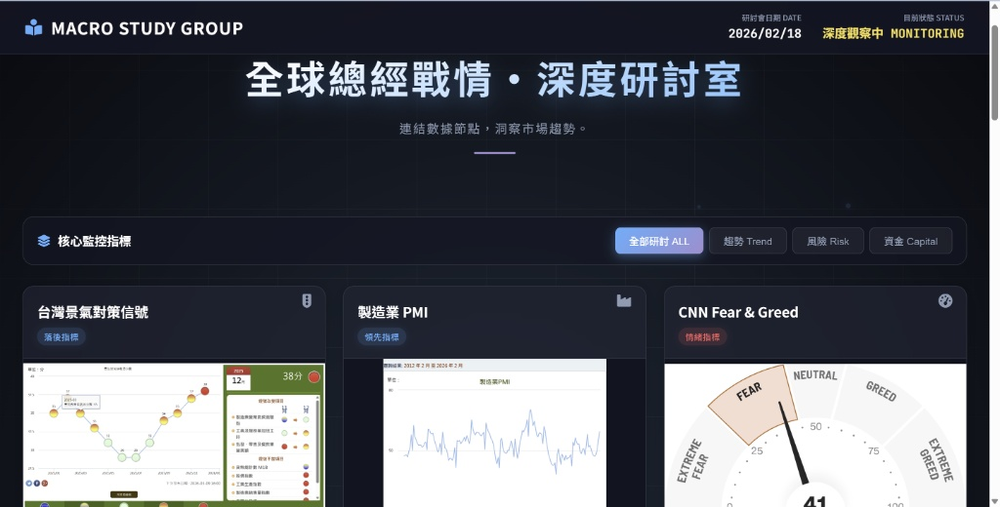

# 📊 Macro Study Group | 全球總經戰情・深度研討室

> **「連結數據節點，洞察市場趨勢。」**
> 專為理性投資人設計的總體經濟監控儀表板。



## 📖 專案簡介 (Introduction)

這是一個靜態網頁儀表板，整合了全球與台灣關鍵的總體經濟指標。透過視覺化的卡片設計與連結，幫助使用者快速掌握市場目前的 **趨勢 (Trend)**、**風險 (Risk)** 與 **資金水位 (Capital)**。

介面採用沈浸式的暗色系「研討室」風格，搭配知識粒子背景動畫，提供專注且深度的分析體驗。

## 🚀 核心功能 (Key Features)

本儀表板將指標分為三大核心維度進行監控：

### 1. 📈 趨勢指標 (Trend)
* **台灣景氣對策信號**：判斷台股長線進出場點（藍燈買、紅燈賣）。
* **製造業 PMI**：以 50 為榮枯線，判斷產業擴張或衰退。
* **未完成訂單減客戶存貨**：製造業循環的關鍵領先指標。

### 2. ⚡ 風險指標 (Risk)
* **CNN Fear & Greed**：市場情緒指標（極度恐懼 vs 極度貪婪）。
* **美債殖利率曲線 (10Y-2Y)**：預測經濟衰退的準確訊號（倒掛）。
* **VIX 恐慌指數 vs S&P500**：美股避險指標。
* **VIX 恐慌指數 vs 台股加權**：台股避險指標。

### 3. 💰 資金指標 (Capital)
* **美國 CPI 消費者物價**：聯準會升降息的決策依據。
* **美元指數 (DXY) vs 台股**：觀察資金流向（美元強則台股弱，反之亦然）。
* **台股大盤 PE 本益比**：衡量大盤估值是否過熱。

## 📂 檔案結構 (File Structure)

```text
stock-analysis/
│
├── index.html                  # 主程式 (儀表板介面)
├── README.md                   # 專案說明文件
├── dashboard_preview.jpg       # 專案預覽截圖 (請確保此檔案存在)
│
└── pic/                        # 圖片素材資料夾
    ├── 景氣訊號燈.jpg
    ├── 製造業PMI.png
    ├── Fea &Greed (儀表板).png
    ├── 美國-10年期減2年期公債利差.png
    ├── 美國-消費者物價指數[CPI].png
    ├── 恐慌指VS_SP500.png
    ├── 美元指數vs加權指數.png
    ├── 台股大盤本益比and加權指數.png
    ├── 台灣-未完成訂單減客戶存貨.png
    └── VIXvs台股加權.png

🛠️ 技術棧 (Tech Stack)
HTML5 / CSS3: 建構語意化結構與 RWD 響應式佈局。

CSS Animation: 製作背景粒子漂浮與掃描線效果。

Glassmorphism: 採用現代化的玻璃擬態 UI 設計風格。

Font Awesome: 使用專業的圖示庫。

JavaScript (Vanilla): 處理指標分類篩選功能。

💡 使用說明 (Usage)
將專案 Clone 到本地或下載所有檔案。

確保所有分析圖表已存入 pic/ 資料夾中。

直接使用瀏覽器打開 index.html 即可開始觀測。

點擊卡片下方的按鈕，可連結至財經 M 平方、CNN 或 TradingView 查看即時動態圖表。

⚠️ 免責聲明 (Disclaimer)
本專案提供的數據與策略僅供學術研討與參考，不構成任何投資建議。金融市場瞬息萬變，投資請務必獨立思考並審慎評估風險。
